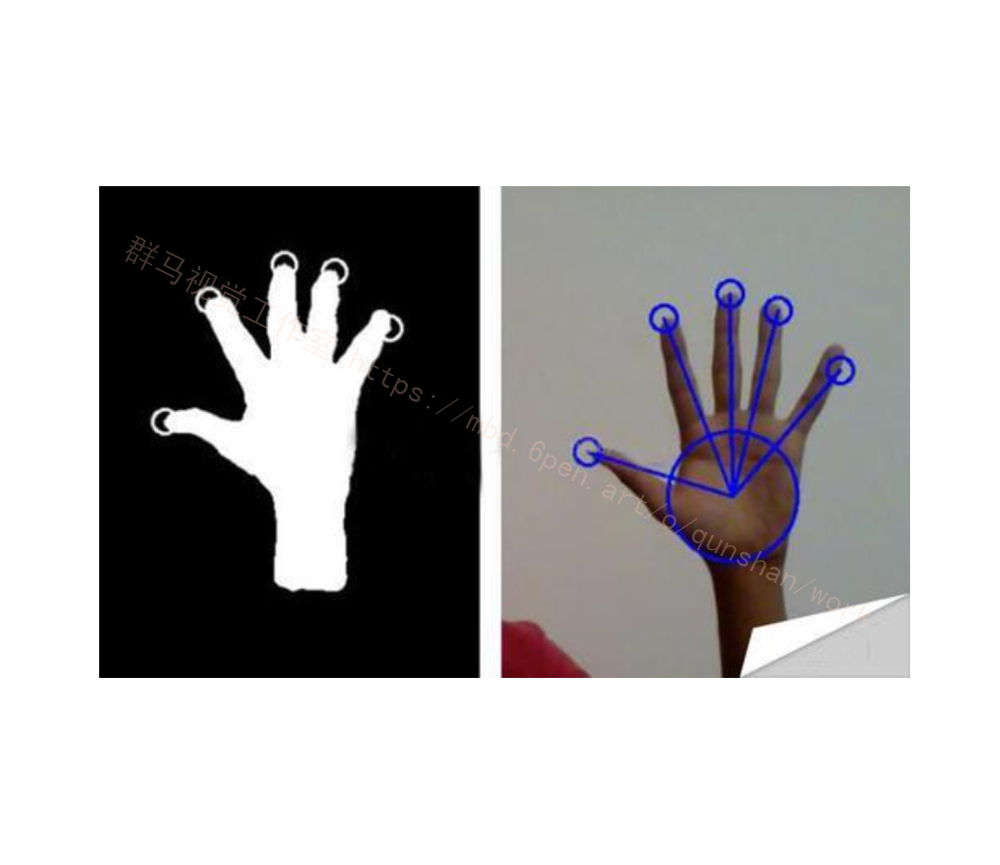
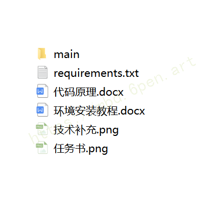
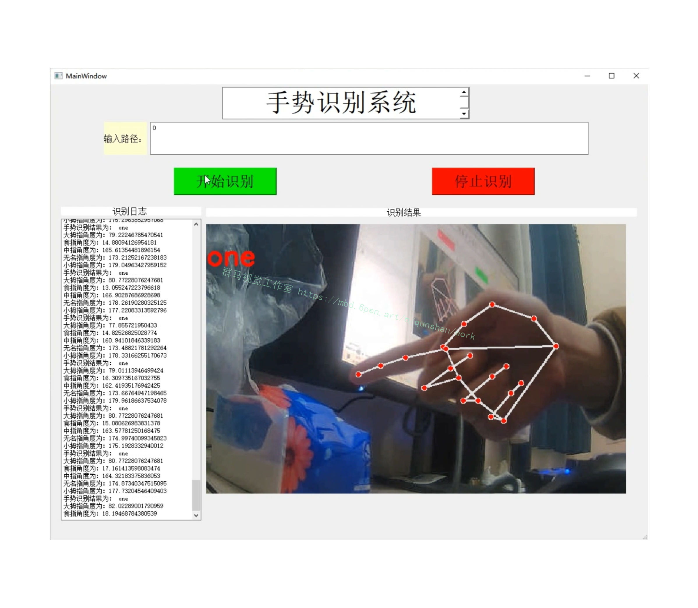
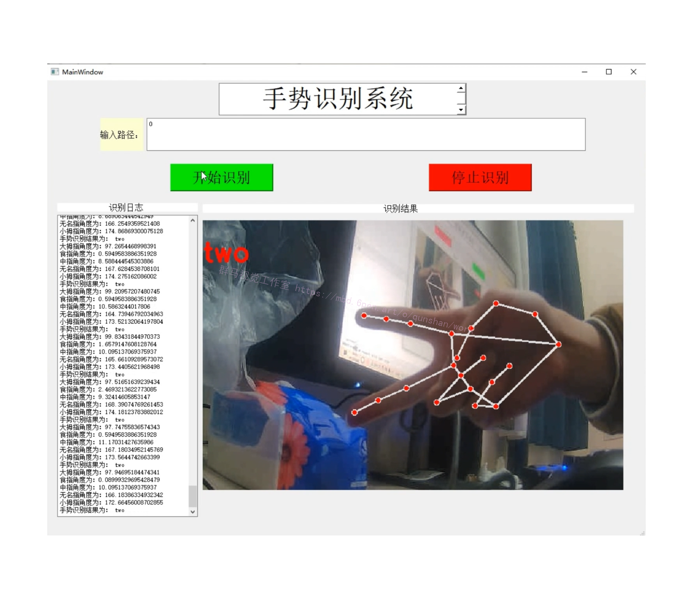
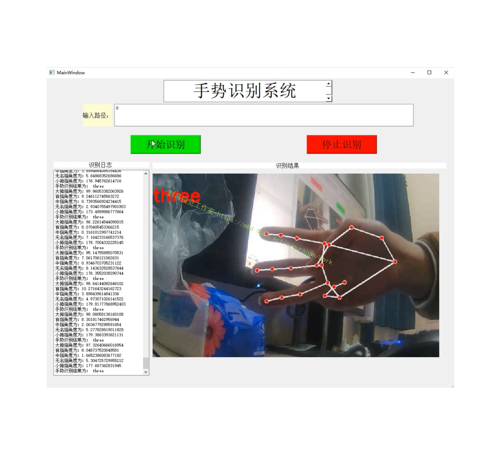
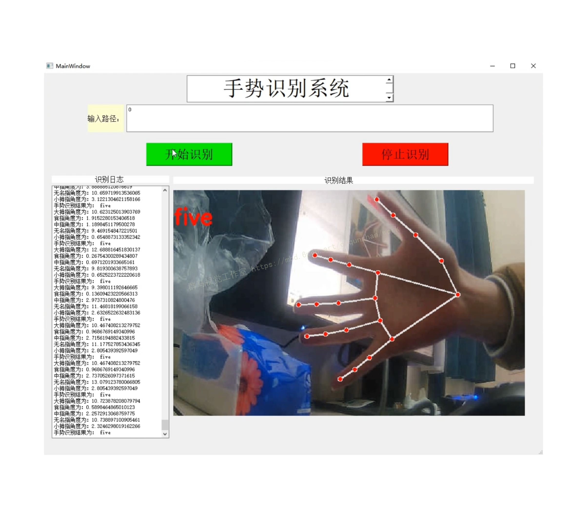


# Python手势识别与控制
## 概述

本文中的手势识别与控制功能主要采用 OpenCV 库实现, OpenCV是一个基于BSD许可(开源)发行的跨平台计算机视觉库, 可以运行在Linux, Windows, Android和Mac-OS操作系统上. 它轻量级而且高效—-由一系列 C 函数和少量 C++ 类构成, 同时提供了Python, Ruby, MATLAB等语言的接口, 实现了图像处理和计算机视觉方面的很多通用算法.



本文主要[参考该博客的方案](https://afdian.net/item?plan_id=3e7af2c85dad11edb64b52540025c377)，使用了OpenCV的视频采集, 图像色域转换, 颜色通道分割, 高斯滤波, OSTU自动阈值, 凸点检测, 边缘检测, 余弦定理计算手势等功能.

## 准备工作

**安装 Python-OpenCV 库**

*   pip install opencv-python -i [https://mirrors.ustc.edu.cn/pypi/web/simple](https://link.zhihu.com/?target=https%3A//mirrors.ustc.edu.cn/pypi/web/simple)

利用 **-i** 为pip指令镜像源, 这里使用电子科技大学的源, 速度比官方源更快.

**安装 Numpy 科学计算库**

*   pip install numpy -i [https://mirrors.ustc.edu.cn/pypi/web/simple](https://link.zhihu.com/?target=https%3A//mirrors.ustc.edu.cn/pypi/web/simple)

**安装 PyAutogui 库**

*   pip install pyautogui -i [https://mirrors.ustc.edu.cn/pypi/web/simple](https://link.zhihu.com/?target=https%3A//mirrors.ustc.edu.cn/pypi/web/simple)

## 代码实现
```
import numpy as np
import cv2
imname = "6358772.jpg"
# 读入图像
'''
使用函数 cv2.imread() 读入图像。这幅图像应该在此程序的工作路径，或者给函数提供完整路径.
警告：就算图像的路径是错的，OpenCV 也不会提醒你的，但是当你使用命令print(img)时得到的结果是None。
'''
img = cv2.imread(imname, cv2.IMREAD_COLOR)
'''
imread函数的第一个参数是要打开的图像的名称(带路径)
第二个参数是告诉函数应该如何读取这幅图片. 其中
cv2.IMREAD_COLOR 表示读入一副彩色图像, alpha 通道被忽略, 默认值
cv2.IMREAD_ANYCOLOR 表示读入一副彩色图像
cv2.IMREAD_GRAYSCALE 表示读入一副灰度图像
cv2.IMREAD_UNCHANGED 表示读入一幅图像，并且包括图像的 alpha 通道
'''
# 显示图像
'''
使用函数 cv2.imshow() 显示图像。窗口会自动调整为图像大小。第一个参数是窗口的名字，
其次才是我们的图像。你可以创建多个窗口，只要你喜欢，但是必须给他们不同的名字.
'''
cv2.imshow("image", img) # "image" 参数为图像显示窗口的标题, img是待显示的图像数据
cv2.waitKey(0) #等待键盘输入,参数表示等待时间,单位毫秒.0表示无限期等待
cv2.destroyAllWindows() # 销毁所有cv创建的窗口
# 也可以销毁指定窗口:
#cv2.destroyWindow("image") # 删除窗口标题为"image"的窗口
# 保存图像
'''
使用函数 cv2.imwrite() 来保存一个图像。首先需要一个文件名，之后才是你要保存的图像。
保存的图片的格式由后缀名决定.
'''
#cv2.imwrite(imname + "01.png", img)
cv2.imwrite(imname + "01.jpg", img)
```
## 摄像头数据采集
我们经常需要使用摄像头捕获实时图像。OpenCV 为这种应用提供了一个非常简单的接口。让我们使用摄像头来捕获一段视频，并把它转换成灰度视频显示出来。从这个简单的任务开始吧。

为了获取视频，你应该创建一个 VideoCapture 对象。它的参数可以是设备的索引号，或者是一个视频文件。设备索引号就是在指定要使用的摄像头。一般的笔记本电脑都有内置摄像头。所以参数就是 0。你可以通过设置成 1 或者其他的来选择别的摄像头。之后，你就可以一帧一帧的捕获视频了。但是最后，别忘了停止捕获视频。

cap.read() 返回一个布尔值（True/False）。如果帧读取的是正确的，就是 True。所以最后你可以通过检查他的返回值来查看视频文件是否已经到了结尾。有时 cap 可能不能成功的初始化摄像头设备。这种情况下上面的代码会报错。你可以使用cap.isOpened()，来检查是否成功初始化了。如果返回值是True，那就没有问题。否则就要使用函数 cap.open()。
[图片上传失败...(image-ffa87e-1661755697120)]
```
class Capture(object):
'''
Capture object
:param deviceID: device ID of your capture device, defaults to 0
:type deviceID: :obj:`int`
Example
>>> import pygr
>>> cap = pygr.Capture()
'''
def __init__(self, deviceID=0): # ID为0, 表示从默认的摄像头读取视频数据
self.deviceID = deviceID
self.capture = cv2.VideoCapture(self.deviceID) #
def read(self):
_, frame = self.capture.read() # 调用默认摄像头捕获一帧图像
frame = cv2.bilateralFilter(frame, 5, 50, 100) # 对捕获到的图像进行双边滤波
image = Image.fromarray(frame) # 转换图像数据格式
return image
```
**视频数据的处理**

为了更准确的识别视频数据中包含的手势信息, 需要对视频数据进行预处理, 包括背景减除, 人体皮肤侦测.

**背景减除**
参考[该博客的方案](https://mbd.pub/o/bread/Yp6ampxr)

在很多基础应用中背景检出都是一个非常重要的步骤。例如顾客统计，使用一个静态摄像头来记录进入和离开房间的人数，或者是交通摄像头，需要提取交通工具的信息等。在所有的这些例子中，首先要将人或车单独提取出来。

技术上来说，我们需要从静止的背景中提取移动的前景。如果你有一张背景（仅有背景不含前景）图像，比如没有顾客的房间，没有交通工具的道路等，那就好办了。我们只需要在新的图像中减去背景就可以得到前景对象了。

但是在大多数情况下，我们没有这样的（背景）图像，所以我们需要从我们有的图像中提取背景。如果图像中的交通工具还有影子的话，那这个工作就更难了，因为影子也在移动，仅仅使用减法会把影子也当成前景。真是一件很复杂的事情。为了实现这个目的科学家们已经提出了几种算法。OpenCV 中已经包含了其中三种比较容易使用的方法: BackgroundSubtractorMOG , BackgroundSubtractorMOG2 , BackgroundSubtractorGMG。这里我们使用的是 **BackgroundSubtractorMOG2 .**

BackgroundSubtractorMOG 和 BackgroundSubtractorMOG2


BackgroundSubtractorMOG2 是一个以混合高斯模型为基础的前景/背景分割算法。它是 P.KadewTraKuPong和 R.Bowden 在 2001 年提出的。它使用 K（K=3 或 5）个高斯分布混合对背景像素进行建模。使用这些颜色（在整个视频中）存在时间的长短作为混合的权重。背景的颜色一般持续的时间最长，而且更加静止。一个像素怎么会有分布呢？在 x，y 平面上一个像素就是一个像素没有分布，但是我们现在讲的背景建模是基于时间序列的，因此每一个像素点所在的位置在整个时间序列中就会有很多值，从而构成一个分布。

在编写代码时，我们需要使用函数： **cv2.createBackgroundSubtractorMOG()** 创建一个背景对象。这个函数有些可选参数，比如要进行建模场景的时间长度，高斯混合成分的数量，阈值等。将他们全部设置为默认值。然后在整个视频中我们是需要使用 **backgroundsubtractor.apply()** 就可以得到前景的掩模了。

**BackgroundSubtractorMOG2** 也是以高斯混合模型为基础的背景/前景分割算法。它是以 2004 年和 2006 年 Z.Zivkovic 的两篇文章为基础的。这个算法的一个特点是它为每一个像素选择一个合适数目的高斯分布。（上一个方法中我们使用是 K 高斯分布）。这样就会对由于亮度等发生变化引起的场景变化产生更好的适应。

和前面一样我们需要创建一个背景对象。但在这里我们我们可以选择是否检测阴影。如果 detectShadows = True（默认值），它就会检测并将影子标记出来，但是这样做会降低处理速度。影子会被标记为灰色。

我们这里使用的就是 **BackgroundSubtractorMOG2** 算法, 详细代码如下:
```
# 移除视频数据的背景噪声
def _remove_background(frame):
fgbg = cv2.createBackgroundSubtractorMOG2() # 利用BackgroundSubtractorMOG2算法消除背景
# fgmask = bgModel.apply(frame)
fgmask = fgbg.apply(frame)
# kernel = cv2.getStructuringElement(cv2.MORPH_ELLIPSE, (3, 3))
# res = cv2.morphologyEx(fgmask, cv2.MORPH_OPEN, kernel)
kernel = np.ones((3, 3), np.uint8)
fgmask = cv2.erode(fgmask, kernel, iterations=1)
res = cv2.bitwise_and(frame, frame, mask=fgmask)
return res
# 视频数据的人体皮肤检测
def _divskin_detetc(frame):
# 肤色检测: YCrCb之Cr分量 + OTSU二值化
ycrcb = cv2.cvtColor(frame, cv2.COLOR_BGR2YCrCb) # 分解为YUV图像,得到CR分量
(_, cr, _) = cv2.split(ycrcb)
cr1 = cv2.GaussianBlur(cr, (5, 5), 0) # 高斯滤波
_, skin = cv2.threshold(cr1, 0, 255, cv2.THRESH_BINARY + cv2.THRESH_OTSU) # OTSU图像二值化
return skin
```
利用opencv提供的 convexityDefects 凹点检测函数检测图像凹陷的点, 然后利用, 然后根据凹陷点中的 (开始点, 结束点, 远点)的坐标, 利用余弦定理计算两根手指之间的夹角, 其必为锐角, 根据锐角的个数判别手势.

其中,锐角个数为0 ,表示 手势是 拳头 或 一,

锐角个数为0 ,表示 手势是 拳头 或 一,

锐角个数为1 ,表示 手势是 剪刀

锐角个数为2 ,表示 手势是 三,

锐角个数为3 ,表示 手势是 四,

锐角个数为4 ,表示 手势是 布

凹陷点计算

对象上的任何凹陷都被称为凸缺陷。OpenCV 中有一个函数 cv.convexityDefect() 可以帮助我们找到凸缺

陷. 函数调用如下. 如果要查找凸缺陷，在使用函数 cv2.convexHull 找凸包时，参数returnPoints一定要是 False.

```
# 检测图像中的凸点(手指)个数
def _get_contours(array):
# 利用findContours检测图像中的轮廓, 其中返回值contours包含了图像中所有轮廓的坐标点
_, contours, _ = cv2.findContours(array, cv2.RETR_TREE, cv2.CHAIN_APPROX_NONE)
return contours
# 根据图像中凹凸点中的 (开始点, 结束点, 远点)的坐标, 利用余弦定理计算两根手指之间的夹角, 其必为锐角, 根据锐角的个数判别手势.
def _get_defects_count(array, contour, defects, verbose = False):
ndefects = 0
for i in range(defects.shape[0]):
s,e,f,_ = defects[i,0]
beg = tuple(contour[s][0])
end = tuple(contour[e][0])
far = tuple(contour[f][0])
a = _get_eucledian_distance(beg, end)
b = _get_eucledian_distance(beg, far)
c = _get_eucledian_distance(end, far)
angle = math.acos((b ** 2 + c ** 2 - a ** 2) / (2 * b * c)) # * 57
if angle <= math.pi/2 :#90:
ndefects = ndefects + 1
if verbose:
cv2.circle(array, far, 3, _COLOR_RED, -1)
if verbose:
cv2.line(array, beg, end, _COLOR_RED, 1)
return array, ndefects
def grdetect(array, verbose = False):
event = Event(Event.NONE)
copy = array.copy()
array = _remove_background(array) # 移除背景, add by wnavy
thresh = _divskin_detetc(array)
contours = _get_contours(thresh.copy()) # 计算图像的轮廓
largecont = max(contours, key = lambda contour: cv2.contourArea(contour))
hull = cv2.convexHull(largecont, returnPoints = False) # 计算轮廓的凸点
defects = cv2.convexityDefects(largecont, hull) # 计算轮廓的凹点
if defects is not None:
# 利用凹陷点坐标, 根据余弦定理计算图像中锐角个数
copy, ndefects = _get_defects_count(copy, largecont, defects, verbose = verbose)
# 根据锐角个数判断手势, 会有一定的误差
if ndefects == 0:
event.setType(Event.ZERO)
elif ndefects == 1:
event.setType(Event.TWO)
elif ndefects == 2:
event.setType(Event.THREE)
elif ndefects == 3:
event.setType(Event.FOUR)
elif ndefects == 4:
event.setType(Event.FIVE)
return event
```
只要能够检测到手势, 相应的控制就简单很多了, 这里主要模拟手势控制web页面滚动, 手势 五 表示向下滚动, 手势 四 表示向上滚动. 只要明白了手势识别的核心原理, 更复杂的手势控制就完全看个人想象, 比如网络上有很多人实现 手势控制chrome浏览器中的那只小恐龙, 我也尝试过, 但是控制起来难度太大了, 还有的是实现手势播放, 切换歌曲. 只要有python, 这一切都很简单.
# 项目截图



# 项目展示









# 视频演示
[https://www.bilibili.com/video/BV1CY4y1u7Cp/?vd_source=bc9aec86d164b67a7004b996143742dc](https://s.xiaocichang.com/s/14f104)

# 环境教程&完整源码&自定义UI操作界面
参考博客[《Python＆Opencv手势识别系统（完整源码＆自定义UI操作界面＆视频教程）》](https://mbd.pub/o/qunma/work)


---
#### 如果您需要更详细的【源码和环境部署教程】，除了通过【系统整合】小节的链接获取之外，还可以通过邮箱以下途径获取:
#### 1.请先在GitHub上为该项目点赞（Star），编辑一封邮件，附上点赞的截图、项目的中文描述概述（About）以及您的用途需求，发送到我们的邮箱
#### sharecode@yeah.net
#### 2.我们收到邮件后会定期根据邮件的接收顺序将【完整源码和环境部署教程】发送到您的邮箱。
#### 【免责声明】本文来源于用户投稿，如果侵犯任何第三方的合法权益，可通过邮箱联系删除。